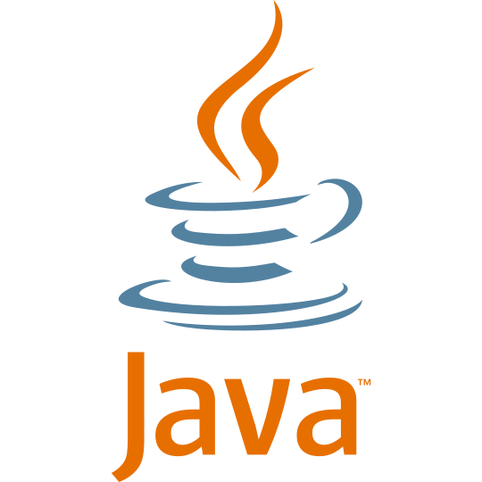
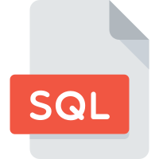
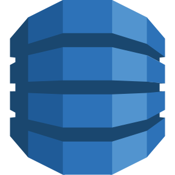
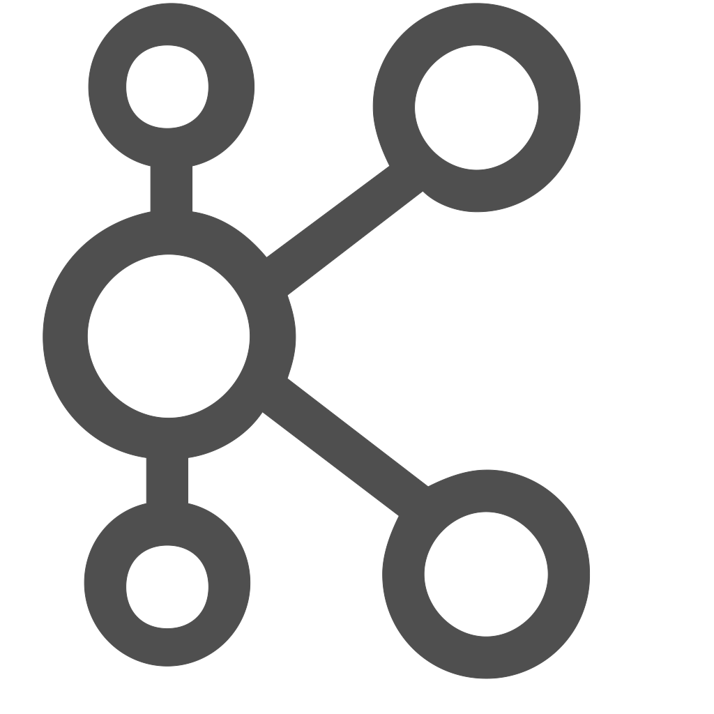

### Hi there 👋

 
<h1 align="center">Languages | Technologies | Frameworks | Tools</h1>

  <code></code>
  <code></code>
  <code></code>
  <code></code>
  <code></code>
  <code></code>

  <code></code>
  <code></code>
  <code></code>
  <code></code>
  <code></code>
  

    <code></code>
    <code></code>
    <code></code>
    <code></code>
    <code></code>

    <code></code>
    <code></code>
    <code></code>
    <code></code>
    <code></code>

<h1 align="center">GitHub Stats</h1>

